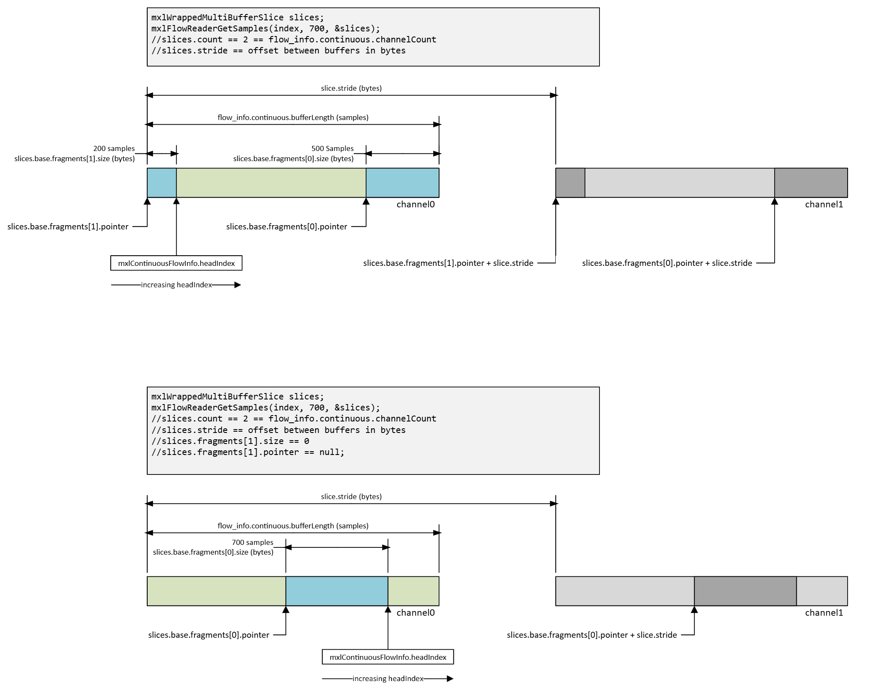

<!-- SPDX-FileCopyrightText: 2025 Contributors to the Media eXchange Layer project. -->
<!-- SPDX-License-Identifier: CC-BY-4.0 -->

# SDK Usage

This page concentrates on the pieces of the public API that describe and expose continuous (sample based) flows. Discrete flows, grain slices, stride
handling, and fragments are already covered in detail in [architecture.md](./architecture.md) under “Grain I/O”.

## Flow functions

### `mxlContinuousFlowConfigInfo` in context

`mxlFlowReaderGetInfo`, `mxlFlowReaderGetConfigInfo`, `mxlFlowWriterGetInfo`, and `mxlFlowWriterGetConfigInfo` all return a full `mxlFlowInfo` copy
that combines immutable configuration (`mxlFlowConfigInfo`) and mutable runtime (`mxlFlowRuntimeInfo`). For a continuous flow the layout inside the
config union is:

| Field | Type | Meaning |
| --- | --- | --- |
| `channelCount` | `uint32_t` | Number of de-interleaved channel ring buffers allocated for the flow. |
| `bufferLength` | `uint32_t` | Number of sample slots in **each** channel buffer. Readers and writers may only access windows shorter than half of this. |
| `reserved` | `uint8_t[56]` | Zeroed padding so the structure remains 64 bytes wide. |

The `common` block that precedes the `continuous` block contributes additional information that every continuous reader needs:

- `grainRate` carries the sample rate (numerator/denominator rational).
- `format` encodes the payload format (`audio/float32`) so you know the sample word size.
- `maxCommitBatchSizeHint` / `maxSyncBatchSizeHint` advertise how many samples are written in one go. Staying within those hints keeps the reader from spinning on the futex that controls `flow->state.syncCounter`.
- `payloadLocation` and `deviceIndex` tell you if the samples sit in host RAM or device memory.

```c
mxlFlowInfo info = {};
MXL_THROW_IF_FAILED(mxlFlowReaderGetInfo(reader, &info));

const mxlContinuousFlowConfigInfo *continuous = &info.config.continuous;
const uint32_t channelCount = continuous->channelCount;
const uint32_t channelBufferLength = continuous->bufferLength;
const mxlRational sampleRate = info.config.common.grainRate;
// sampleRate == samples per second for continuous flows
```

### Memory layout of continuous flow info

The flow metadata file `${mxlDomain}/${flowId}.mxl-flow/data` contains a single `mxlFlowInfo` object with the following organization:

```
Offset  Size  Description
0x0000  0x04  version (currently 1)
0x0004  0x04  size (must stay 2048)
0x0008  0x80  mxlCommonFlowConfigInfo  (ID, format, rate, batch hints, payload info)
0x0088  0x40  mxlContinuousFlowConfigInfo (channelCount, bufferLength, reserved)
0x00C8  0x40  mxlFlowRuntimeInfo (headIndex, lastWriteTime, lastReadTime, reserved)
0x0108  0x6F8 reserved padding to keep the struct cache-line aligned
```

The actual audio samples do **not** live in `data`. They are stored in `${mxlDomain}/${flowId}.mxl-flow/channels`, a shared memory blob that is
exactly `channelCount * bufferLength * sampleWordSize` bytes long. The layout of this blob is:

```
channel 0 buffer (bufferLength * sampleWordSize bytes)
channel 1 buffer (bufferLength * sampleWordSize bytes)
...
channel N-1 buffer
```

Each channel buffer behaves like a classic circular buffer. The reader and writer API expose this geometry through `mxlWrappedMultiBufferSlice`. The
type inherits the same ideas as the slice documentation referenced above: `base.fragments[0]` and `base.fragments[1]` capture the two contiguous
fragments (slices) you need when a request straddles the wrap-around point, and `stride` spans the gap between channels. When the sample window is
fully contained inside the ring, `fragments[1].size` is simply zero.

### Accessing samples

Reading a window of samples requires three pieces of information:

1. The desired absolute sample index (`index`). This is the last sample you want to include.
2. The number of samples to look backwards by (`count`). This must not exceed `bufferLength / 2`.
3. The timeout you are willing to wait for the window (`timeoutNs`).

`mxlFlowReaderGetSamples` and `mxlFlowReaderGetSamplesNonBlocking` fill an `mxlWrappedMultiBufferSlice` that points into the channel buffer blob.
`payloadBuffersSlices.stride` is the distance (in bytes) between two channels, and `payloadBuffersSlices.count` repeats the slice geometry once per
channel. The pseudocode below shows how to consume `audio/float32` samples while respecting the fragments and stride:

```c
// Read the latest 256 samples per channel, waiting up to 5 ms.
mxlWrappedMultiBufferSlice slices;
mxlFlowRuntimeInfo runtime;
mxlFlowReaderGetRuntimeInfo(reader, &runtime);

const uint64_t lastSample = runtime.headIndex;
const size_t windowLength = 256;
mxlFlowReaderGetSamples(
    reader,
    lastSample,
    windowLength,
    5'000'000,  // 5 milliseconds
    &slices);

const size_t channels = slices.count;
const size_t strideBytes = slices.stride;
const size_t fragment0Samples = slices.base.fragments[0].size / sizeof(float);
const size_t fragment1Samples = slices.base.fragments[1].size / sizeof(float);

for (size_t channel = 0; channel < channels; ++channel) {
    const uint8_t *channelBase0 = static_cast<const uint8_t *>(slices.base.fragments[0].pointer) + channel * strideBytes;
    const uint8_t *channelBase1 = static_cast<const uint8_t *>(slices.base.fragments[1].pointer) + channel * strideBytes;

    const float *firstSlice = reinterpret_cast<const float *>(channelBase0);
    const float *secondSlice = reinterpret_cast<const float *>(channelBase1);

    // Process the first fragment (may already contain the entire window).
    for (size_t i = 0; i < fragment0Samples; ++i) {
        consume_sample(channel, firstSlice[i]);
    }

    // Only needed when the window wrapped around the ring buffer.
    for (size_t i = 0; i < fragment1Samples; ++i) {
        consume_sample(channel, secondSlice[i]);
    }
}
```

Writing samples mirrors the same pattern but uses `mxlMutableWrappedMultiBufferSlice`:

```c
mxlMutableWrappedMultiBufferSlice scratch;
mxlFlowWriterOpenSamples(writer, nextSampleIndex, batchSize, &scratch);
// Fill scratch for every channel respecting fragments and stride, exactly like the reader example.
// ...
mxlFlowWriterCommitSamples(writer);
```

A few important rules fall straight out of the data structure:

- Readers can only observe up to `bufferLength / 2` samples in one call. The other half of the buffer is considered “write in progress”, which prevents races when a writer is wrapping around.
- `index` is inclusive: asking for `(headIndex, 256)` returns samples `headIndex - 255` through `headIndex`.
- Always look at `slices.base.fragments[1].size` before assuming the sample window is contiguous.
- Continuous flows ride on the same slice/fragment helpers as discrete flows. `fragments[0]` and `fragments[1]` are slices of bytes, and `stride`
  identifies how far you have to slide (hence “stride”) to reach the same sample in the next channel.



## Core functions


## Time functions

All time helpers operate on nanoseconds and rational time bases. Continuous flows typically pass the sample rate (`grainRate`) directly to these
helpers when scheduling wake-ups or calculating how far to advance `headIndex`. Refer to `mxl/time.h` for the canonical API surface.
